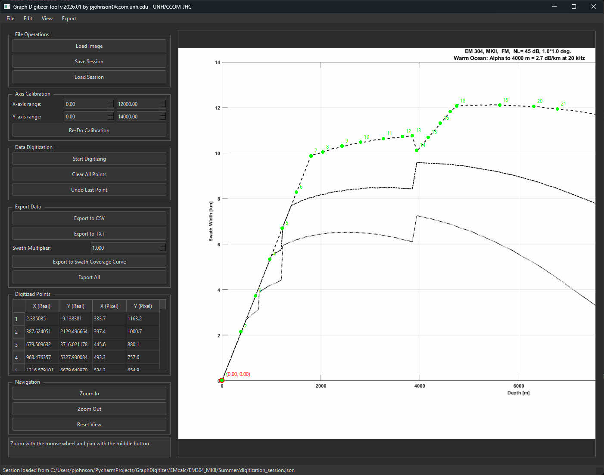

# GraphDigitizer

GraphDigitizer is a desktop tool for digitizing data points from graph images. It supports:

- Loading an image (PNG/JPG/etc.)
- Axis calibration by clicking two known points (origin + max)
- Digitizing curve points by clicking on the graph
- Exporting digitized data to CSV/TXT (and an optional “swath coverage curve” export)
- Saving/loading sessions to resume work later

## Example



Paul Johnson
Center for Coastal and Ocean Mapping
University of New Hampshire
pjohnson@ccom.unh.edu

## Run from source

1. Install dependencies:

```bash
pip install PyQt6 Pillow numpy
```

2. Start the app:

```bash
python graph_digitizer.py
```

## Build a standalone EXE (Windows)

This repo includes a PyInstaller **spec** and a **batch** file:

- `CCOM_GraphDigitizer.spec` (controls the EXE name + icon)
- `build_graphdigitizer.bat` (cleans and runs PyInstaller using the repo’s `.venv`)

The EXE name is:

`CCOM_GraphDigitizer_<version>.exe`

where `<version>` is taken from `__version__` in `graph_digitizer.py`.

The EXE icon is `media/CCOM.ico`.

To build:

```bat
build_graphdigitizer.bat
```

Outputs go to:

`dist\`

## Calibration & digitizing workflow

- Click **Start Calibration**.
  - Button changes to **Calibrating.  Click to Stop**
  - Click the first point (origin) and then the second point (max).
  - After the second point is selected, calibration stops automatically and the button changes to **Re-Do Calibration**.
- If you stop calibration after only selecting 1 point, the button returns to **Start Calibration**.
- Click **Start Digitizing**:
  - Button changes to **Digitizing.  Click to Stop**
  - Click again to stop digitizing.
  - Right-clicking the image also stops digitizing.

## License

This project is licensed under the terms in `LICENSE` (BSD 3-clause).

